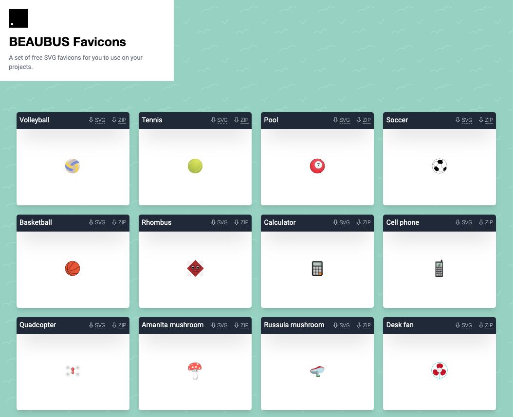

# BEAUBUS Favicons package for Laravel

Package of [110+ free favicons](https://favicons.beaubus.com) for your Laravel project (12 sizes for each favicon). 



## Installation
```shell
composer require beaubus/favicons-for-laravel
php artisan vendor:publish --tag=beaubus-favicons --force
```

> ❗️favicon.ico in /public folder would be changed after installation.
 

Add to the header section of blade file:
```php
@include('favicons::all')
```

> Check if you linked your storage folder with `php artisan storage:link` if urls are not working.

## Change icon
```shell
php artisan beaubus:install-favicon 'fidget spinner'
```

